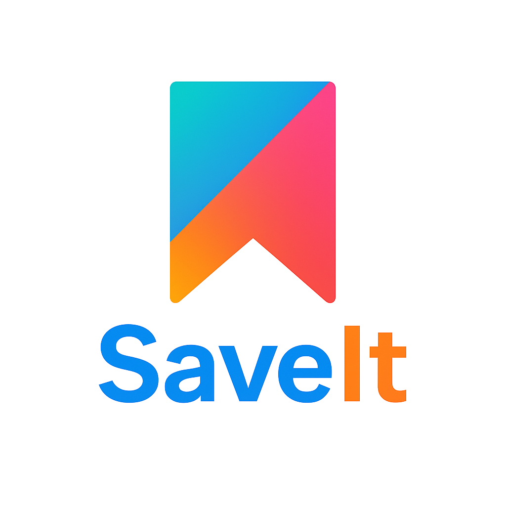

# SaveIt

<div align="center">
  
  <h3>A Modern Bookmark Manager for Chrome</h3>
  <p>Beautifully organize and access your bookmarks directly from the new tab page.</p>

  <p>
    <a href="#features">Features</a> •
    <a href="#installation">Installation</a> •
    <a href="#usage">Usage</a> •
    <a href="#customization">Customization</a> •
    <a href="#contributing">Contributing</a> •
    <a href="#license">License</a>
  </p>
</div>

## 🌟 Features

- **Category Management** — Create, organize, and manage bookmark categories
- **Intuitive Bookmarking** — Add, view, and delete bookmarks within categories
- **Tab Integration** — View all open tabs and add them to categories with a single click
- **Elegant UI** — Clean, dark-themed interface for comfortable browsing
- **Data Privacy** — All data is stored locally in your browser (using IndexedDB)
- **Zero Data Collection** — No data is sent to any servers
- **Drag and Drop** — Organize your bookmarks and categories with intuitive drag-and-drop functionality
- **Collapsible Panels** — Customize your view by toggling sidebar visibility

## 🚀 Installation

1. Clone or download this repository
   ```bash
   git clone https://github.com/Ismailco/SaveIt.git
   ```
2. Open Chrome and navigate to `chrome://extensions/`
3. Enable "Developer mode" in the top-right corner
4. Click "Load unpacked" and select the folder containing this extension
5. The extension is now installed and will override your new tab page

## 📖 Usage

- Open a new tab to access SaveIt
- Click "+ Add Category" to create a new category
- Select a category and click "+ Add Bookmark" to add a new bookmark manually
- Browse your open tabs on the right side and click "+" to add any open tab to the selected category
- Click on a bookmark to visit the website
- Use the toggle buttons to collapse or expand the side panels
- Click the "×" next to a bookmark or category to delete it
- Click "↻ Refresh" to update the list of open tabs

## ✨ Customization

If you want to change the appearance or behavior of the extension:

- `newtab.css` — Modify styling and theming
- `newtab.js` — Customize functionality and behaviors
- `newtab.html` — Adjust the structure and layout
- Replace the icon files in the `icons` folder with your own designs

## 🤝 Contributing

SaveIt was initially created for personal use but has evolved to be shared with the community. Contributions are welcome and appreciated!

1. Fork the repository
2. Create your feature branch (`git checkout -b feature/amazing-feature`)
3. Commit your changes (`git commit -m 'Add some amazing feature'`)
4. Push to the branch (`git push origin feature/amazing-feature`)
5. Open a Pull Request

Feel free to open issues for bug reports, feature requests, or general feedback.

## ⚠️ Notes

- This extension uses IndexedDB, which means data is stored in your browser
- Clearing browser data might delete your saved bookmarks
- There is no sync functionality between different browsers or devices
- The extension requires "tabs" permission to access your open tabs

## 📄 License

This project is licensed under the MIT License - see the [LICENSE](LICENSE) file for details. You are free to use, modify, and distribute this code for personal or commercial purposes.

## 💡 About

SaveIt was originally created as a personal project to streamline bookmark management. What started as a simple tool for personal use has now grown into a project that I'd like to share with others who might find it useful.

---

<div align="center">
  <p>Made with ❤️ by <a href="https://ismailcourr.dev">Ismail Courr</a></p>
</div>
